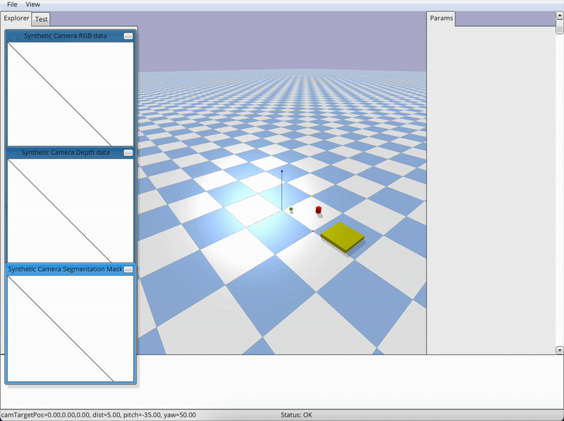

## Hybrid Planner: Classical + LLM (Planning + Language)

Reference implementation of a hybrid planning stack that converts natural language into a tiny task DSL, validates it with guardrails, and executes it in simulation using classical planning backends (A* for navigation, CHOMP-like trajectory optimization for manipulation).

### Features
- **Task DSL**: Simple, typed JSON schema with strict validation.
- **Parser**: Rule-based NL → DSL conversion with optional Ollama integration stub.
- **Classical planners**: A* on 2D grid for navigation; simplified CHOMP for manipulation.
- **Simulation**: PyBullet table-top world with a virtual gripper and objects.
- **Skills**: `navigate(goal)`, `perceive(object)`, `grasp(pose|object)`, `place(pose|location)` with pre/post-conditions.
- **Executor**: Guardrails, schema validation, retries, timeouts, and fallback policy.
- **Server**: FastAPI skill server for parse/plan/execute.
- **Metrics**: Success rate, time-to-first-plan, corrections, path cost.
- **Tests**: Unit tests for DSL, parser, planners, executor.

### Repo Layout

```
hybrid-planner/
  envs/                # grid world or table-top sim
  skills/              # Python callables with pre/post conditions
    navigate.py, grasp.py, place.py
  dsl/                 # parser + schema, e.g., JSON actions
    schema.py, parse_llm.py
  planners/            # a_star.py, rrt_star.py, chomp.py
  executor/            # plan validator, guardrails, retries
  server/              # FastAPI server
  demos/
    tidy_table.py
  tests/
  requirements.txt
  README.md
```

### Quickstart

1) Prereqs
- Python 3.10–3.12
- OS: Windows, macOS, or Linux are supported

2) Create a virtual environment and install Python deps

- macOS/Linux (bash/zsh):
```bash
python3 -m venv .venv
source .venv/bin/activate
pip install --upgrade pip
pip install -r requirements.txt
```

- Windows (PowerShell):
```powershell
python -m venv .venv
.\.venv\Scripts\Activate.ps1
python -m pip install --upgrade pip
pip install -r requirements.txt
```

3) Optional: PyBullet GUI

The project runs headless by default; enable the GUI with `--gui` or `HP_BULLET_GUI=1`.

- macOS (pip):
```bash
pip install pybullet
```
Conda alternative:
```bash
conda create -n hp python=3.12 -y
conda activate hp
pip install -r requirements.txt
conda install -c conda-forge pybullet -y
```

- Linux:
```bash
pip install pybullet
```
If the GUI fails to launch, install system libs (Debian/Ubuntu example):
```bash
sudo apt-get update && sudo apt-get install -y libegl1 libgl1
```
Headless servers can run without a display (the code uses `p.DIRECT` when `--gui` is not set).

- Windows:
```powershell
pip install pybullet
```
Run from a Windows terminal (not WSL) for best GUI support. In WSL, use an X server or omit `--gui`.

4) Run tests

```bash
pytest -q
```

5) Launch the server

```bash
uvicorn server.main:app --host 0.0.0.0 --port 8000
```

Open `http://localhost:8000/docs` for interactive API.

6) Run the demo

```bash
python demos/tidy_table.py --gui --gui-hold 10
```

Notes:
- GUI shows: green sphere (gripper), red cylinder (mug), blue cube (block), yellow shelf.
- If the window closes quickly, use `--gui-hold <seconds>`.
- Set `HP_BULLET_GUI=1` to enable GUI by default when using the server.

### Preview (PyBullet GUI)



### Task DSL

Minimal, typed, and strictly validated JSON schema. Example:

```json
{
  "goal": "tidy_table",
  "steps": [
    {"action": "perceive", "args": {"object": "red_mug"}},
    {"action": "grasp", "args": {"object": "red_mug"}},
    {"action": "place", "args": {"location": "shelf_A"}}
  ]
}
```

See `dsl/schema.py` and `dsl/parse_llm.py`.

### Planners
- `planners/a_star.py`: A* on 2D occupancy grid.
- `planners/chomp.py`: Simplified CHOMP-like optimizer for 2D end-effector paths with obstacle cost from a distance field.

### Simulation
- `envs/table_top.py`: PyBullet tabletop world with objects (mug/block), shelf region, and a virtual gripper moving in a plane above the table.
- `envs/grid_world.py`: Lightweight 2D grid world for navigation planning demonstrations.

### Skills & Executor
- `skills/`: `navigate`, `grasp`, `place` with pre/post-conditions.
- `executor/`: Validates DSL, performs planning, executes with guardrails, timeouts, and a fallback policy.

### Metrics
Metrics are logged to stdout and returned by the executor:
- Plan success rate, time-to-first-plan
- Number of parser corrections (guardrail effectiveness)
- Path/trajectory cost vs. baseline

### Configuration
Environment variables:
- `HP_BULLET_GUI=1` to enable PyBullet GUI when running server.

### Development

Run formatting and tests:
```bash
pytest -q
```

### API Overview
- `POST /parse`  — NL → DSL
- `POST /plan`   — DSL → plan artifacts
- `POST /execute`— Execute plan in sim
- `POST /run_task`— NL → DSL → plan → execute

Swagger UI at `http://localhost:8000/docs`.

### Limitations
- The CHOMP implementation is simplified and operates on a 2D end-effector abstraction.
- The virtual gripper teleports vertically for grasp/place; full 3D IK is out-of-scope.

### License
MIT
